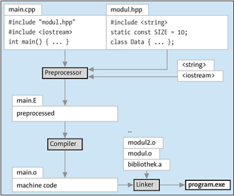

# CPP The Comprehensive Guide - Book

Compiler

Turning code into an executable.

- Preprocessor
    - Ingest includes, expand c macros
- Lexer and Parser
    - xlate char strings into tokens. Groups chars into semantic units, ie string, number or function
- Cpp Semantics
    - xlate templates into functions and classes, then classes into instances
- Intermediate Representation (IR)
    - Generate machine oriented but platform independent code and optimizes it
- Code Generation
    - Generate platform dependent asm code
- Object Files
    - xlate asm into byte sequences, output is object and static libs
- Link
    - Creates an executable or DLL form object and lib files

Take note, there are a lot of compilers out there.

- Gnu c++
- Clang++ form LLVM
- MS Visual C++
- Intel DPC++

# Chapter 3 C++ For Newcomers

- Statements
    - execution is statement by statement
    - ; separate statements
- Expressions
    - literal or variables
- Data Types
    - common like ints/doubles
    - pointers and references
    - int vs int* (pointer)
- Functions and Methods
    - Functions in a dtype are methods
- Classes
    - dtypes that you bundle with behavior via added methods
- Function Calls
    - Takes parameters and returns a result
- Parameters/Returns
    - The func defines if a parameter/return is used as a value or as a reference/pointer

- - -

- Stack and Heap, no Garbage Collection
    - No automatic cleaning of objects
    - Automatic memory management, but no garbage collection
    - Aquisition constructor and Release desctructor
        - Bind the lifetime of a heap resource to the lifetime of the stack variable
- Virtual vs Real Machines
    - cpp must be compiled for each platform

